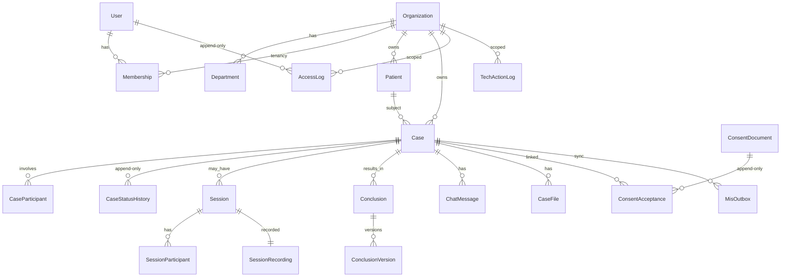

# Архитектурный документ — Miru Platform

**Версия:** 1.0  
**Дата:** 03.08.2026  
**Статус:** готов к согласованию заказчиком (приложение к ТЗ `01_ТЗ_Miru_Remote`)  
**Охват:** Miru Remote (этап 1) + общий фундамент для Miru FrontDesk  
**Сопровождающие файлы:** `docs/architecture.pdf`, `docs/diagrams/er-core.png`

---

## 1. Технологический стек

| Слой | Выбор | Обоснование |
|---|---|---|
| Сервер | **TypeScript + NestJS** | Статическая типизация (НФТ 9.2); модульный монолит; широкая доступность специалистов в РК; один язык с клиентами |
| ORM / миграции | **Prisma** | Миграции в репозитории (НФТ 2.5); предсказуемая схема; удобные транзакции |
| СУБД | **PostgreSQL 16** (self-hosted) | Соответствие НФТ 1.1; Row Level Security / политики для изоляции МО; append-only через права БД |
| Клиент медработников | **React + Vite** | Рынок РК; быстрый десктопный UX |
| Пациент | **Telegram Mini App (React)** | Требование ТЗ; Bot API разрешён без ПМД в сообщениях |
| Панель техслужбы | **React + Vite** (отдельное приложение, отдельный origin) | ТЗ 10.4: обособленный адрес, не пересекается с прикладной частью |
| Терминал FrontDesk | **React + Electron/kiosk** (волна F1) | Режим киоска; общий API |
| Видеосвязь + запись | **LiveKit** (self-hosted) + egress в MinIO | НФТ 2.6; сессия не стартует без доступности записи |
| Объектное хранилище | **MinIO** (S3 API) | НФТ 2.7; шифрование at rest; signed URL |
| Очереди / фон | **Redis + BullMQ** | Уведомления, egress, отложенные задачи, retry интеграций |
| ЭЦП | Модуль `signing` → **NCALayer** | ТЗ 9.3; заменяемый адаптер (мобильная ЭЦП — этап 3) |
| Секреты | Env + файлы секретов / Vault-совместимый слой | НФТ 4.5; в git не хранятся |
| Контейнеры | Docker + Compose (dev/test); Compose/Swarm или k8s (prod) | НФТ 2.3–2.4 |
| CI | GitHub Actions / GitLab CI | lint, typecheck, test, audit зависимостей |

**Не используем:** managed Supabase и зарубежные облака для ПМД (НФТ 1.1); внешние SaaS видеосвязи.

**Разрешённые внешние сервисы без ПМД:** Telegram Bot API, SMS-шлюз РК.

### 1.1. Существенные внешние библиотеки и компоненты

| Компонент | Назначение |
|---|---|
| `@nestjs/common`, `@nestjs/core`, `@nestjs/config` | каркас API, DI, конфигурация |
| `@prisma/client`, `prisma` | доступ к БД, миграции |
| `argon2` | хэширование паролей (Argon2id) |
| `class-validator`, `zod` | серверная валидация входа |
| `bullmq`, `ioredis` | очереди и фоновые задачи |
| `@aws-sdk/client-s3` | MinIO / S3 API (артефакты, записи) |
| `livekit-server-sdk` | токены комнат, управление LiveKit |
| `otplib` (или аналог) | TOTP 2FA |
| `react`, `react-dom`, `vite` | клиенты staff / admin / miniapp |
| `@telegram-apps/sdk` (или WebApp API) | Telegram Mini App |
| NCALayer (браузерный мост) | ЭЦП заключений |

Лицензии фиксируются в отчёте к сдаче (НФТ 11.7). Экспериментальные / узконишевые зависимости без согласия заказчика не вводятся (НФТ 2.2).

### 1.2. Обоснование выбора команды

Стек TypeScript end-to-end выбран из‑за: (1) единой кодовой базы API и клиентов; (2) статической типизации по НФТ 9.2; (3) широкой доступности специалистов на рынке РК относительно Go/Java-only команд на сопоставимый срок; (4) пригодности к контейнерному деплою и аттестации (self-hosted Postgres/MinIO/LiveKit без зарубежного SaaS для ПМД). Опыт команды с NestJS/React/PostgreSQL — основной; LiveKit и NCALayer закрываются ранним spike в W1–W2.

---

## 2. Структура системы

### 2.1. Выбор: модульный монолит

Для масштаба 13 МО / до 15 000 ДМУ в месяц микросервисы избыточны. Модульный монолит:

- одна БД с явными схемами/границами модулей;
- один деплой API на старте;
- границы модулей запрещают циклические зависимости;
- отдельно выносятся только **LiveKit**, **MinIO**, **Redis** (инфраструктура).

Панель администрирования — **отдельный frontend** и **отдельный Nest-модуль/guard-контур**, который **не имеет SQL-доступа к таблицам содержания ПМД** (заключения, чаты, расшифровки, бинарные артефакты).

### 2.2. Модули API (`apps/api`)

| Модуль | Зона ответственности |
|---|---|
| `identity` | Пользователи, пароли, 2FA, сессии, роли |
| `tenancy` | МО, отделения, ВА, изоляция tenant |
| `cases` | Случаи ДМУ, статусы, участники |
| `consent` | Оферты, согласия, акцепты (append-only) |
| `scheduling` | Графики, слоты, запись |
| `session` | Комнаты LiveKit, метаданные, запрет старта без записи |
| `artifacts` | Файлы, checksum, signed URL |
| `conclusion` | Заключения, версии |
| `signing` | Адаптер ЭЦП (NCALayer) |
| `notifications` | Telegram / SMS |
| `mis` | Адаптеры МИС + ручной мост |
| `dossier` | Сборка досье случая |
| `audit` | Журнал доступа к ПМД + журнал техслужбы |
| `catalog` | Витрина, справочники |
| `admin` | Операции панели (без чтения ПМД) |
| `frontdesk` | Точки API для терминалов (волна F1) |

```
[Mini App] [Staff Web] [Admin Panel] [FrontDesk kiosk]
        \       |            |              /
         \      |            |             /
              [ API Gateway / NestJS ]
               |    |     |      |
          Postgres MinIO LiveKit Redis
```

---

## 3. Модель данных (ключевое)

### 3.1. Основные сущности

- `Organization` (МО) → `Department`, `Ambulatory`
- `User`, `Membership` (user↔org↔roles)
- `Patient` (ИИН хэш/нормализованный идентификатор + контакты с маскированием в admin)
- `Case` + `CaseStatusHistory` (append-only)
- `ConsentDocument` (версия, hash текста) + `ConsentAcceptance` (append-only)
- `Schedule` / `Slot` / `Appointment`
- `Session`, `SessionParticipant`, `SessionRecording`
- `ChatMessage`, `CaseFile` (checksum)
- `Conclusion` + `ConclusionVersion` (immutable после подписи)
- `AccessLog`, `TechActionLog` (append-only)
- `MisOutbox` / `MisInbox` (идемпотентность интеграций)

### 3.1.1. ER-диаграмма (ключевые связи)



Графическая копия для PDF и презентаций:


| От | К | Кардинальность | Примечание |
|---|---|---|---|
| Organization | Case, Patient, Membership | 1:N | граница изоляции МО |
| Case | CaseStatusHistory | 1:N | только INSERT |
| Case | CaseParticipant | 1:N | object-level authz |
| ConsentDocument | ConsentAcceptance | 1:N | хэш текста + акцепт |
| Conclusion | ConclusionVersion | 1:N | правка = новая версия |
| Session | SessionRecording | 1:1 | объект в MinIO + checksum |

### 3.2. Неизменяемость доказательной базы

1. Таблицы: `consent_acceptance`, `access_log`, `case_status_history`, `conclusion_version`, checksums артефактов.
2. Прикладная учётка БД: **REVOKE DELETE, UPDATE** на этих таблицах (НФТ 5.5).
3. Изменение заключения = новая `ConclusionVersion` со ссылкой на предыдущую.
4. Checksum (SHA-256) пишется при создании; проверяется при выгрузке досье.

### 3.3. Изоляция МО

- Каждая сущность с ПМД содержит `organization_id`.
- На каждом запросе: `Membership` + роль + (для случая) участие в `CaseParticipant`.
- Admin-сервис работает через отдельные views/API, исключающие столбцы содержания ПМД.
- Фильтрация только в UI **запрещена** как единственная мера (НФТ 3.7).

### 3.4. Миграции

Только Prisma Migrate в CI/CD. Ручные DDL в проде запрещены.

### 3.5. Прод-БД: размещение и роли (на согласование)

Раздел для государственного контура: ПМД и доказательная база. Локальный Postgres в Docker — только разработка; **пром и тест не используют зарубежный managed DBaaS**.

#### 3.5.1. Размещение

| Требование | Решение |
|---|---|
| Территория хранения и обработки | Только **Республика Казахстан** (НФТ 1.1–1.2) |
| СУБД | PostgreSQL 16+, **self-hosted** (ВМ / bare metal / выделенный инстанс каз. ЦОД) |
| Запрещено для ПМД | Supabase managed, AWS/GCP/Azure за пределами РК, любой зарубежный DBaaS |
| Допустимо | On-prem заказчика; казахстанский ЦОД (ориентир: PS.kz, Kazakhtelecom и аналоги — **выбор заказчика**) |
| Сетевой контур | БД не в публичном сегменте; доступ только с app-серверов контура (НФТ 1.5) |
| Test = Prod по составу | Отдельный инстанс Postgres в том же классе защиты, без копирования промышленных ПМД без регламента (НФТ 12.3) |

**Требуется письменное решение заказчика:** конкретный ЦОД / площадка и кто администрирует ОС и СУБД (заказчик / исполнитель / подрядчик площадки).

#### 3.5.2. Роли PostgreSQL (разделение полномочий)

| Роль БД | Кто использует | Права |
|---|---|---|
| `miru_migrator` | только CI/CD / контролируемый migrate job | DDL по миграциям; не используется приложением в runtime |
| `miru_app` | NestJS API (прикладная часть) | DML на рабочих таблицах; на append-only (**доказательная база**): только **INSERT + SELECT**; **REVOKE UPDATE, DELETE** |
| `miru_admin` | сервис панели техслужбы | SELECT/DML только на метаданные и справочники; **нет SELECT** на тексты заключений, чаты, тела согласий, расшифровки; ИИН/ФИО — через маскирующие VIEW |
| `miru_readonly_audit` | роль «Аудитор» / выгрузки по регламенту | SELECT на журнал доступа и досье-метаданные по процедуре; без произвольного ad-hoc |
| `postgres` / superuser | аварийное администрирование | вне приложения; доступ по break-glass, с фиксацией в орг. журнале заказчика |

Прикладной код **не** подключается суперпользователем. Строки подключения — в менеджере секретов, не в репозитории.

#### 3.5.3. Таблицы доказательной базы (append-only на уровне СУБД)

На учётку `miru_app` для таблиц:

- `consent_acceptance`
- `access_log`
- `case_status_history`
- `conclusion_version` (и связанные checksum-записи артефактов)

выполняется: `GRANT SELECT, INSERT` + `REVOKE UPDATE, DELETE`.  
Удаление по истечении сроков хранения ЭМЗ — **отдельная контролируемая процедура** под учёткой мигратора/регламента, не «cleanup job» приложения (НФТ 4.10, 5.5).

#### 3.5.4. Шифрование, целостность, время

| Мера | Как |
|---|---|
| At rest | Шифрование тома ОС и/или прозрачное шифрование СУБД; ключи вне диска данных |
| In transit | Только TLS 1.2+ к Postgres (`sslmode=require` / verify-full в prod) |
| Бэкапы | Ежедневно, хранение ≥30 суток, **шифрованные**, только площадки в РК; ежемесячная проверка восстановления |
| RPO / RTO | ≤24 ч / ≤4 ч (НФТ 8.7–8.8) |
| Время | UTC в БД + фиксация TZ; NTP на серверах (НФТ 5.6) |
| ПМД в логах | Запрещены в технических журналах приложения и Postgres log (НФТ 4.7) |

#### 3.5.5. Что делает разработчик vs заказчик

| Исполнитель | Заказчик / площадка |
|---|---|
| Схема, миграции, роли в SQL-скриптах репозитория | Выбор и договор ЦОД / on-prem |
| Подключение приложения под `miru_app` / `miru_admin` | Сетевая изоляция, firewall, VPN |
| Документ мер защиты (НФТ 11.6) | ОРД, модель угроз, аттестация ГТС (орг. часть) |
| Drill восстановления на test | Регламент допуска к prod и break-glass |

#### 3.5.6. Решения, которые нужно подтвердить до prod

1. Площадка размещения Postgres (наименование ЦОД / on-prem).  
2. Кто владеет ключами шифрования томов и бэкапов.  
3. Канал администрирования СУБД (кто имеет superuser).  
4. Срок и процедура уничтожения данных по ДСМ-175/2020.  
5. Допустимость реплики только внутри РК (синхронная/асинхронная — по RPO).

---

## 4. Безопасность

### 4.1. Аутентификация

- Пароли: **Argon2id**.
- Политика: ≥12 символов, словарь распространённых, lockout после 5 неудач.
- 2FA обязательна для медработников и администраторов (TOTP; SMS — резерв по согласованию).
- Пациент: ИИН + код подтверждения (SMS / канал МИС) в Mini App.
- Сессии: TTL, revoke on logout, принудительное завершение админом МО.

### 4.2. Авторизация

- RBAC по ролям ТЗ §4.
- **Object-level:** доступ к случаю только участникам случая (и аудитору на чтение досье).
- Guards на каждом handler; запрет полагаться на клиент.

### 4.3. Админ платформы ≠ ПМД

- Отдельный DB role / connection string для `admin` модуля.
- Grants только на метаданные: id, статусы, timestamps, размеры, checksum, коды ошибок.
- ИИН/ФИО — маскированные представления.

### 4.4. Журнал доступа к ПМД

- Перехват в application interceptor **после** успешной авторизации на read/download операций ПМД.
- Поля: user, role, org, object, action, time (UTC+TZ), IP.
- Пишется в той же транзакции или через надёжный outbox; сбой записи журнала → отказ операции (fail-closed для критичных чтений).

### 4.5. Шифрование и секреты

- TLS 1.2+ everywhere; HTTP redirect deny.
- Postgres TDE/volume encryption + MinIO SSE.
- Записи сессий: encrypted objects; только short-lived signed URL.
- Секреты: не в git; runtime injection.

### 4.6. Защита типовых уязвимостей

Параметризация Prisma, server validation (Zod), CSRF для cookie-session staff, rate limit auth/SMS, security headers, dependency audit в CI.

---

## 5. Интеграции

### 5.1. Слой `mis`

```
CaseService → MisPort (interface) → ZhetysuAdapter | DamumedAdapter | ManualBridgeAdapter
```

Замена МИС = новый адаптер, без изменения `cases` / `conclusion`.

### 5.2. Ручной мост

Включается per-МО. Регистратор вводит направление, отмечает внесение в МИС, ежедневный реестр «оказано vs внесено».

### 5.3. ЭЦП

`SigningPort` → `NcaLayerSigningAdapter`. Пакетная очередь «К подписи». Сверка ИИН сертификата с консультантом.

### 5.4. FrontDesk (этап после Remote)

События: создание случая ДМУ, слот сценария В, признак активного случая. Общие `Patient`, `Organization`, `AccessLog`.

---

## 6. Видеосвязь и записи

```
[Клиенты] --WebRTC--> [media-1: LiveKit]
                           |
                        egress
                           v
                    [storage-1: MinIO recordings/]
                           |
                      checksum + meta
                           v
                    [data-1: Postgres SessionRecording]
```

1. API создаёт комнату LiveKit **только если** egress/recording pipeline healthy (healthcheck до выдачи токена входа).
2. Egress пишет в MinIO (encrypted bucket `recordings/`).
3. Метаданные сессии в Postgres; объект — checksum (SHA-256).
4. Обрыв: reconnect до 30 мин в том же `Session`.
5. Доступ к записи: только авторизованный участник/аудитор через short-lived signed URL; постоянные публичные ссылки запрещены (НФТ 4.3–4.4).

### Оценка канала и диска (ориентир)

| Параметр | Значение |
|---|---|
| Одновременные сессии (НФТ) | ≥ 50 |
| Битрейт на сессию (A/V) | ≈ 1–2 Мбит/с (деградация до аудио от 512 кбит/с) |
| Канал media-1 | ориентир **≥ 200 Мбит/с** суммарно с запасом |
| Объём записи 1 час | ≈ 0,5–1 ГБ (зависит от кодека/качества) |
| 15 000 ДМУ/мес × ср. 20 мин | грубо **2,5–5 ТБ/мес** сырых записей до сжатия/ретеншна |
| Срок хранения | по приказу ДСМ-175/2020; удаление — контролируемая процедура |

Калибровка на нагрузочном тесте test-контура в W3.

При недоступности записи → ошибка клиенту + предложение перенести (ТЗ 6.3.3).

---

## 7. Развёртывание

### Окружения

| Env | Назначение |
|---|---|
| `dev` | локальный Compose |
| `test` | идентичен prod по составу (НФТ 12.3) |
| `prod` | РК, закрытый контур |

### Серверы (ориентир prod, РК)

| Узел | Роль | Ориентир |
|---|---|---|
| app-1 | API + web static | 4 vCPU / 8 GB |
| data-1 | Postgres + Redis | 4–8 vCPU / 16 GB + SSD |
| media-1 | LiveKit + egress | 8 vCPU / 16 GB |
| storage-1 | MinIO (записи, файлы) | SSD по расчёту записей (от 500 GB) |
| backup | encrypted offsite в РК | ежедневно, ≥30 суток |

Требования к **прод-БД** (размещение, роли СУБД, append-only, шифрование) — **§3.5**.

### Ориентировочная стоимость размещения в РК

Оценка по публичным тарифам каз. провайдеров (ориентир **PS.kz / аналоги**, ЦОД в РК), **август 2026**, без НДС и без учёта спецтарифов под аттестацию. Финальная смета — после выбора площадки заказчиком.

| Узел (эквивалент) | Ориентир тарифа | ≈ ₸ / мес |
|---|---|---|
| app-1 (~4 vCPU / 8 GB) | VPS класса Basic-4 | 25–35 тыс. |
| data-1 (~4–8 vCPU / 16 GB + SSD) | VPS/Cloud класса Basic-5 или выделенный | 45–90 тыс. |
| media-1 (~8 vCPU / 16 GB) | VPS/Cloud / dedicated | 50–100 тыс. |
| storage-1 (от 500 GB SSD + трафик) | object / block storage | 20–60 тыс. |
| backup (реплика бэкапов в РК) | storage + трафик | 15–40 тыс. |
| **Итого prod (пилотный контур)** | | **≈ 155–325 тыс. ₸ / мес** |
| test-контур (урезанный, тот же состав сервисов) | 50–70% от prod | **≈ 80–200 тыс. ₸ / мес** |

**Замечания:**

- Для аттестации ГТС часто требуется выделенный/изолированный контур — стоимость может быть выше VPS «с витрины».
- Диск под записи сессий растёт с числом ДМУ: ориентир планирования — до 15 000 ДМУ/мес; объём и битрейт калибруются на нагрузочном тесте W3.
- On-prem МО: CAPEX на железо вместо opex аренды; эксплуатация СУБД — по §3.5.5.

### Бэкапы

Ежедневно: шифрованный Postgres backup + репликация/бэкап MinIO; хранение только в РК ≥30 суток; ежемесячный drill восстановления; RPO ≤24 ч, RTO ≤4 ч (НФТ 8.7–8.8; детали — §3.5.4).

```bash
# воспроизводимый подъём
docker compose -f deploy/docker-compose.yml up -d --build
```

---

## 8. План работ (4 недели — Miru Remote)

| Неделя | Состав | Проверяемый результат |
|---|---|---|
| **W1** | Фундамент: identity, tenancy, audit, consent, cases/status, scheduling, Mini App скелет, staff login | Создание случая → согласие → слот; журнал доступа пишет события |
| **W2** | LiveKit+запись, чат/файлы, сценарий В, отложенный режим, очередь по профилю | Сессия с записью; без LiveKit/egress сессия не стартует |
| **W3** | Заключение, NCALayer batch, MIS adapters + manual bridge, dossier, витрина, реестр/дашборд | Досье ≤60 с; ручной мост; подпись пакетом |
| **W4** | Admin panel сценарий Д, чек-лист МО, тесты §7, доки НФТ §11, пилот 1 МО | МО подключается без разработчика и без SQL |

**FrontDesk** — после стабилизации Remote: волна F1 (киоск, запись, экстренный вызов, OTA), затем F2 (оплата, обращения).

### Распределение (ориентир, 2 инженера)

- **A (backend/platform):** API, БД, ИБ, интеграции, LiveKit, admin API  
- **B (clients):** Mini App, staff web, admin UI, уведомления UX  

### Риски и предположения

| Риск | Митигация |
|---|---|
| API МИС не выданы вовремя | Весь учёт через ручной мост; контракт адаптера фиксируем заранее |
| NCALayer нестабилен в браузере | Ранний spike в W1/W2; пакетная подпись обязательна |
| Недооценка CPU/диска под запись | Нагрузочный тест на test-контуре в W3 |
| SMS-провайдер / шаблоны | Согласовать в W1; Telegram — основной канал |
| Экстренный контур FrontDesk без регламента МО | Не включать в «в эксплуатации» до регламента |

### Что можем не успеть за 4 недели Remote (явно)

1. Дашборд заведующего отделением в полном объёме ([Ж]).  
2. Демонстрация экрана / индикация качества связи ([Ж]).  
3. Пакетное досье за период ([Ж]).  
4. Полные production-адаптеры Жетысу/Дамумед — если спецификации API не придут до конца W2 (останется ручной мост + mock adapter).  
5. FrontDesk — **вне** 4 недель Remote.

### Что нужно от заказчика, чтобы не остановиться

1. Подтверждение стека и **площадки прод-БД в РК** (§3.5.1, §3.5.6).  
2. Спеки МИС или письменное «стартуем с ручным мостом».  
3. SMS-провайдер, Telegram bot token (test).  
4. Тестовые ЭЦП/NCALayer.  
5. Доступы к серверам test/prod в РК; кто admin СУБД / ключи шифрования.  
6. Тексты оферты/согласий (хотя бы v1).  

---

## 9. Соответствие критериям отклонения (чек-лист)

| Критерий заказчика | Где в документе |
|---|---|
| Раздел безопасности конкретен | §4 |
| Журналирование доступа | §4.4 |
| Неизменяемость доказательной базы | §3.2, §3.5.3 |
| Изоляция МО | §3.3 |
| Прод-БД: размещение в РК и роли СУБД | §3.5 |
| Ориентировочная стоимость размещения | §7 |
| ER / связи сущностей | §3.1.1 |
| Перечень существенных библиотек | §1.1 |
| Нет зарубежных облаков для данных | §1, §3.5, §7 |
| Недельный план + риски + неуспеваемое | §8 |

---

*Документ актуализируется к сдаче (НФТ 11.1).*
